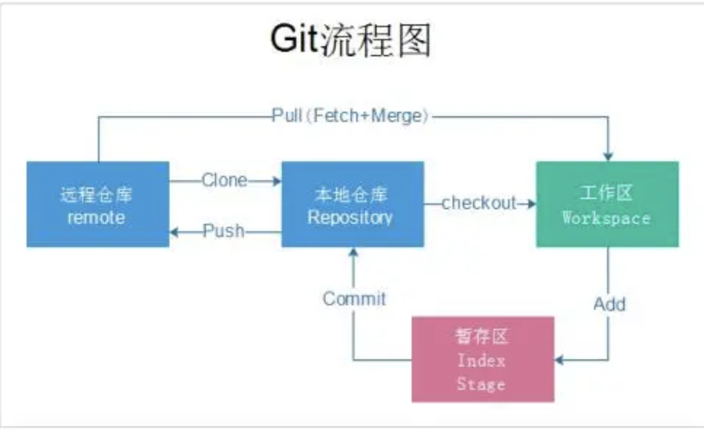

#git相关操作

##参考引用

**B站up:麦兜搞it**

## git概念

git按工作区域可以划分为本地仓库(Local Repository)和远程仓库(Remote Repository).

本地仓库)还可以划分为工作区(Work Space)、索引区(Index Stage)、本地库(Local Repository)

摘自百度图库

## git本地库

**初始化本地库**	

git init 会在.下创建一个.git目录

————————

**设置用户名及邮箱**

设置本仓库信息

设置用户名	git config user.name "李兴宇"

设置邮箱		git config user.email "463106848@qq.com"

信息写入		.git/config文件下

查看方式		git config -l

设置全局信息

设置用户名	git config --global user.name "李兴宇"

设置邮箱		git config --global user.email "463106848@qq.com"

信息写入		~.gitconfig

查看方式		git config --global -l

优先级			如果本地库有信息就用本地库,如果没有设置就用全局的

## 从工作区到索引区-从索引区到本地库

###**场景一**

在工作区创建file1		echo "1st commit" > file1	

******

查看本地git仓库状态	git status

Untracked files:	**状态1:在本地工作区还未提交到索引区**

 (use "git add <file>..." to include in what will be committed)

**file1**

******

将file1添加到索引区	git add file1

此时会在.git/object目录下产生一个obj对象 该对象是根据SHA1算法生成.利用 **git cat-file -t [SHA1值]**查看对象类型是一个**blob对象**,利用**git cat-file -p [SHA1值]**查看对象内容是**1st commit**

查看本地git仓库状态	git status

On branch main	**-- 当前在主分支上 --**

No commits yet	**-- 状态2:还有没有提交到本地库 --**	

Changes to be committed:

 (use "git rm --cached <file>..." to unstage)

​	**new file:  file1**  **-- new file状态表示新增文件 --**

******

将file1添加到本地库	git commit -m "1st" ,此时返回信息中有一个**(root-commit) 7c2bb70**表示这是该仓库第一次提交,7c2bb70表示产生的commit对象的SHA1值的前6位

lixingyu@ lixingyudeMacBook-Protest$ git commit -m "1st" 

[main (root-commit) 7c2bb70] 1st	  **-- 7c2bb70 commit对象SHA1值 --**

 1 file changed, 1 insertion(+)

 create mode 100644 file1

******

该commit对象git/object目录下,利用 **git cat-file -t 7c2bb70**查看对象类型确定确实是**comit对象**,

lixingyu@ lixingyudeMacBook-Protest$ git cat-file -t 7c2bb70

commit

******

利用**git cat-file -p 7c2bb70**查看对象内容,会看见除了commit对象外还会有一个**新的对象tree**

lixingyu@ lixingyudeMacBook-Protest$ git cat-file -p 7c2bb70

tree 15331ee37d42cd5b10970f94666b94db14569d01

author lxy <Xingy.li@sunyard.com> 1627183992 +0800

committer lxy <Xingy.li@sunyard.com> 1627183992 +0800

1st **--commit是提交的信息--**

******

查看新对象tree的类型确实是tree

lixingyu@ lixingyudeMacBook-Protest$ git cat-file -t 15331ee

tree

******

查看tree对象内容,就是创建的file1文件

lixingyu@ lixingyudeMacBook-Protest$ git cat-file -p 15331ee

权限     类型 								SHA1值                             文件名

100644 blob 3018d1a1eb7a54f9f5225deb210f18595189061a	file1

确实是文件内容

lixingyu@ lixingyudeMacBook-Protest$ git cat-file -p 3018d1

1st commit

******

此时我们了解了从工作区创建一个文件到提交到本地库的区过程,创建了三个obj对象以及这三个对象的类型及内容

******

### 场景二

已提交到本地仓库的文件进行修改

Echo "2nd commit" >> file1

******

On branch main

Changes not staged for commit:

 (use "git add <file>..." to update what will be committed)

 (use "git restore <file>..." to discard changes in working directory)

​	modified:  file1	**--状态3:已提交到本地仓库的文件进行了修改--**

no changes added to commit (use "git add" and/or "git commit -a")

******

在提交到本地库后

git commit -m "2nd commit"

[main ceba627] 2nd commit

 1 file changed, 1 insertion(+)

查看commit对象,发现该对象有一个parent,是上一次的commit对象

git cat-file -p ceba627

tree 0b8ac5d8a3f6d8cc45c0b444f42109b95d6e40ab

parent 7c2bb70c3caa2157c132a0faae319738144d6e5c

author lxy <Xingy.li@sunyard.com> 1627204485 +0800

committer lxy <Xingy.li@sunyard.com> 1627204485 +0800

2nd commit

****

利用git log 查看可以看出时间线关系

commit ceba6271072c568141bcd1d79c132ac8354d1970 (HEAD -> main)

Author: lxy <Xingy.li@sunyard.com>

Date:  Sun Jul 25 17:14:45 2021 +0800

  2nd commit

commit 7c2bb70c3caa2157c132a0faae319738144d6e5c

Author: lxy <Xingy.li@sunyard.com>

Date:  Sun Jul 25 11:33:12 2021 +0800

  1st

******

## 本地分支

###本地分支的创建

git init时会默认在本地创建main分支

查看本地分支 git branch -v

本地创建分支 git branch develop 以当前所在分支为root创建develop分支,

本地分支文件所在位置 .git/refs/heads/main .git/refs/heads/develop

其内容就是该分支最后一次commit对象

lixingyu@ lixingyudeMacBook-Protest$ cat .git/refs/heads/develop 

ceba6271072c568141bcd1d79c132ac8354d1970	 **--指向develop分支最后一次commit对象--**

lixingyu@ lixingyudeMacBook-Protest$ cat .git/refs/heads/main 

ceba6271072c568141bcd1d79c132ac8354d1970	` **--指向main分支最后一次commit对象--**

******

###本地分支的切换

当前所在分支可以利用 查看本地分支 git branch -v

 develop ceba627 2nd commit

\* main ceba627 2nd commit	 **--*表示当前所在分支--**

.git/HEAD文件也指向当前所在分支

 cat .git/HEAD 

ref: refs/heads/main	**--HEAD指向refs/heads/main--**

切换分支	git checkout develop

.git/HEAD文件也指向当前所在分支

 cat .git/HEAD 

ref: refs/heads/develop	**--HEAD指向refs/heads/main--**

******

### 本地分支的合并

分支合并有两种形式 git merge dev在main分支合并dev分支

1.**fast-forward**

该类型满足条件:dev分支拥有main分支的最新一次提交,可以看出merge后HEAD指向refs/heads/main所指向的commit对象76d12,他的parent时ec5be

摘自百度图库

2.**three-way-merge**

该类型不满足dev分支用main分支最新一次提交,可以看出merge后HEAD指向refs/heads/main所指向的commit对象9e78i,他有两个parent是035cc和e3475

摘自百度图库

******

### 分支的删除

分支删除(强制) git branch -D dev

分支删除(普通) git branch -d dev 使用-d时如果dev分支有没有merge到main分支的内容会提醒先进行merge

******

###分支的rebase操作

在两个分支满足three-way-merge的情况下,如果这时想合并后HEAD所指向的commit只有一个parent,相当于把分支合并成为一个,这是我们可以使用rebase.**在执行rebase后,dev分支之前的区别与main的commit对象会被重新计算SHA1值,HEAD会指向最新的值**,关于rebase相关操作场景我也会继续了解补充

摘自百度图库
**--表示工作区和索引区file1文件有差别--**

index 59a992a..1358861 100644

--- a/file1	**--索引区--**

+++ b/file1	**--工作区--**

@@ -1,2 +1,2 @@ **--用@@分块显示,文件大会有多块.表示索引区文件第1行往后数2行和工作区文件第1行往后数2行的地方内容不同--**

 1st commit

-2nd commit	**--少了2nd commit--**

+3rd commit	**--多了3rd commit--**

####索引区和本地库的差别

git diff --cached

diff --git a/file1 b/file1

index 59a992a..1358861 100644

--- a/file1	**--索引区--**

+++ b/file1	**--本地库--**

@@ -1,2 +1,2 @@

 1st commit

-2nd commit

+3rd commit

******

## git远程仓库

###添加远程仓库两种方式

git clone [SHH/HTTP]

git add remote origin [SHH/HTTP]

建议使用克隆,克隆后本地第代码库的main会与远程代码库的本地拷贝origin/main产生关联关系

在 cat .git/config会存放远程仓库信息

查看远程仓库信息git remote origin

******

### git本地分支和远程分支

查看所有分支	

lixingyu@ lixingyudeMacBook-Progit-$ git branch -a

\* main

 remotes/origin/HEAD -> origin/main

 remotes/origin/main

******

查看本地分支

lixingyu@ lixingyudeMacBook-Progit-$ git branch 

\* main

******

查看远程分支

lixingyu@ lixingyudeMacBook-Progit-$ git branch -r

 origin/HEAD -> origin/main

 origin/main

******

在.git/ref/remotes/origin下并没有main文件指向远程的commit而只有一个HEAD文件

lixingyu@ lixingyudeMacBook-Progit-$ cat .git/refs/remotes/origin/HEAD 

ref: refs/remotes/origin/main

是因为git把远程的main文件压缩到了./git/packed-refs 中

cat .git/packed-refs 

\# pack-refs with: peeled fully-peeled sorted 

738df09ffd6aacea919a785f4f5ee3a42d9d8d45 refs/remotes/origin/main

******

查看日志文件也可证明

lixingyu@ lixingyudeMacBook-Progit-$ git log

commit 738df09ffd6aacea919a785f4f5ee3a42d9d8d45 (HEAD -> main, origin/main, origin/HEAD)

Author: lxy-git-code <55471195+lxy-git-code@users.noreply.github.com>

Date:  Sun Jul 25 09:18:29 2021 +0800

Initial commit

**注意 origin/main指向的commit对象时存储在本地的也就是在clone时刻从远程仓库读取并下载到本地的远程分支文件,此时如果远程仓库发生变化在没有同步的情况下这个文件是不会变化的**

在远程仓库发生变化时使用git fetch origin main重新同步信息

lixingyu@ lixingyudeMacBook-Progit-$ git fetch

remote: Enumerating objects: 5, done.

remote: Counting objects: 100% (5/5), done.

Unpacking objects: 100% (3/3), done.

remote: Total 3 (delta 0), reused 0 (delta 0), pack-reused 0

From github.com:lxy-git-code/git-

  738df09..d402168 main    -> origin/main

******

发现多了一个main文件,这个文件始终是最后一次fetch远程库对应分支的commit对象.

lixingyu@ lixingyudeMacBook-Progit-$ cat .git/refs/remotes/origin/main 

d4021681cacfe83e90448d30b9607d670e4bc98

******

查看远程分支分本地分支关联关系

lixingyu@ lixingyudeMacBook-Progit-$ git remote show origin

\* remote origin

 Fetch URL: git@github.com:lxy-git-code/git-.git

 Push URL: git@github.com:lxy-git-code/git-.git

 HEAD branch: main 	**本地分支main**

 Remote branch:

  main tracked	**远程分支在本地的映射文件被本地的main分支关联**

 Local branch configured for 'git pull':

  main merges with remote main

 Local ref configured for 'git push':

  main pushes to main (up to date)

******

lixingyu@ lixingyudeMacBook-Progit-$ git branch -vv

\* main 738df09 [origin/main: behind 1] Initial commit **本地库的main分支比远程分支在本地的映射文件origin/main落后一个commit**

******

再merge远程仓库在本地的映射文件到本地main分支

lixingyu@ lixingyudeMacBook-Progit-$ git merge origin/main

Updating 738df09..d402168

Fast-forward

 README.md | 3 ++-

 1 file changed, 2 insertions(+), 1 deletion(-)

******

git log观察日志发现此时已经在同一位置,不落后了

lixingyu@ lixingyudeMacBook-Progit-$ git log

commit d4021681cacfe83e90448d30b9607d670e4bc98c (HEAD -> main, origin/main, origin/HEAD)

Author: lxy-git-code <55471195+lxy-git-code@users.noreply.github.com>

Date:  Sun Jul 25 19:00:15 2021 +0800

  Update README.md

commit 738df09ffd6aacea919a785f4f5ee3a42d9d8d45

Author: lxy-git-code <55471195+lxy-git-code@users.noreply.github.com>

Date:  Sun Jul 25 09:18:29 2021 +0800

  Initial commit

******

利用gitbranch -vv查看一样的结果

lixingyu@ lixingyudeMacBook-Progit-$ git branch -vv

 main d402168 [origin/main] Update README.md

******

###本地库和远程库在本地的映射合并

远程库的更新有两种情况,在合并时需要注意

####远程仓库文件更新后合并到本地

是2种 fast-foward和three-way-merge.原理参考上文.

先使用git fetch origin mian 

再使用git merge origin/main

####远程库创建了新的分支

#####远程库创建了新的分支使用

将远程的分支的信息同步到本地	git remote show origin

\* remote origin

 Fetch URL: git@github.com:lxy-git-code/git-.git

 Push URL: git@github.com:lxy-git-code/git-.git

 HEAD branch: main

 Remote branches:

  bgfx  new (next fetch will store in remotes/origin) **新的远程分支在本地的映射文件将会在下一次fetch后存储在remotes/origin**

  dev   new (next fetch will store in remotes/origin)**新的远程分支在本地的映射文件将会在下一次fetch后存储在remotes/origin**

  develop tracked

  main  tracked

 Local branch configured for 'git pull':

  main merges with remote main

 Local ref configured for 'git push':

  main pushes to main (up to date)

******

git fetch (可以上远程库别名 分支名)

From github.com:lxy-git-code/git-

 \* [new branch]   bgfx    -> origin/bgfx

 \* [new branch]   dev    -> origin/dev

lixingyu@ lixingyudeMacBook-Progit-$ cat .git/refs/remotes/origin/

HEAD   bgfx   dev   main   

******

查看本地所有分支,发现远程分支在本地的映射文件已经有了

ixingyu@ lixingyudeMacBook-Progit-$ git branch -a

\* main

 remotes/origin/HEAD -> origin/main

 remotes/origin/bgfx

 remotes/origin/dev

 remotes/origin/main

然而此时并没有本地的分支映射这些远程分支在本地的映射文件,因此我们需要创建本地分支并与这些分支产生关联

******

查看分支映射也可以看出除了main有映射其他还没有

lixingyu@ lixingyudeMacBook-Progit-$ git branch -vv

\* main d402168 [origin/main] Update README.md

******

创建本地分支并与远程分支在本地的映射文件进行关联

lixingyu@ lixingyudeMacBook-Progit-$ git checkout -b bgfx origin/bgfx

Branch 'bgfx' set up to track remote branch 'bgfx' from 'origin'.

Switched to a new branch 'bgfx'

lixingyu@ lixingyudeMacBook-Progit-$ git checkout -b dev origin/dev

Branch 'dev' set up to track remote branch 'dev' from 'origin'.

Switched to a new branch 'dev'

******

查看本地所有分支,发现本地分支文件已经有了

 git branch -a

 bgfx

\* dev

 main

 remotes/origin/HEAD -> origin/main

 remotes/origin/bgfx

 remotes/origin/dev

 remotes/origin/develop

 remotes/origin/main

******

查看分支映射也可以看出本地分支和远程在本地的映射文件建立了关联关系

lixingyu@ lixingyudeMacBook-Progit-$ git branch -vv

 bgfx d402168 [origin/bgfx] Update README.md

\* dev d402168 [origin/dev] Update README.md

 main d402168 [origin/main] Update README.md

******

#####远程库删除了原有的分支

如果在远程库上删除了分支,那么本地如果不同步更新信息也是不知道分支删除了.

lixingyu@ lixingyudeMacBook-Progit-$ git remote show origin

\* remote origin

 Fetch URL: git@github.com:lxy-git-code/git-.git

 Push URL: git@github.com:lxy-git-code/git-.git

 HEAD branch: main

 Remote branches:

  main            tracked

  refs/remotes/origin/bgfx  stale (use 'git remote prune' to remove)	**远程分支bgfx已经过期**

  refs/remotes/origin/dev   stale (use 'git remote prune' to remove)	**远程分支dev已经过期**

 Local branches configured for 'git pull':

  bgfx merges with remote bgfx

  dev merges with remote dev

  main merges with remote main

 Local ref configured for 'git push':

  main pushes to main (up to date)

******

删除映射文件

git fetch --prune

******

文件已经不存在了

lixingyu@ lixingyudeMacBook-Progit-$ cat .git/refs/remotes/origin/

HEAD main

*****

git remote show origin

\* remote origin

 Fetch URL: git@github.com:lxy-git-code/git-.git

 Push URL: git@github.com:lxy-git-code/git-.git

 HEAD branch: main

 Remote branch:

  main tracked

 Local branches configured for 'git pull':

  bgfx merges with remote bgfx

  dev merges with remote dev

  main merges with remote main

 Local ref configured for 'git push':

  main pushes to main (up to date)

******

lixingyu@ lixingyudeMacBook-Progit-$ git branch -vv

 bgfx d402168 [origin/bgfx: gone] Update README.md	**gone表示不存在**

\* dev d402168 [origin/dev: gone] Update README.md

 main d402168 [origin/main] Update README.md

******

最后删除本地分支即可

lixingyu@ lixingyudeMacBook-Progit-$ git branch -D bgfx

Deleted branch bgfx (was d402168).

lixingyu@ lixingyudeMacBook-Progit-$ git branch -D dev

Deleted branch dev (was d402168).

******

### 什么是FETCH_HEAD

####场景

远程仓库恢复了bgfx分支后,本地更新信息

lixingyu@ lixingyudeMacBook-Progit-$ git remote show origin

\* remote origin

 Fetch URL: git@github.com:lxy-git-code/git-.git

 Push URL: git@github.com:lxy-git-code/git-.git

 HEAD branch: main

 Remote branches:

  bgfx new (next fetch will store in remotes/origin)

  main tracked

 Local branch configured for 'git pull':

  main merges with remote main

 Local ref configured for 'git push':

  main pushes to main (up to date)

lixingyu@ lixingyudeMacBook-Progit-$ git fetch

From github.com:lxy-git-code/git-

 \* [new branch]   bgfx    -> origin/bgfx

******

查看FETCH_HEAD 目前FETCH_HEAD 在远程master的本地映射文件上

lixingyu@ lixingyudeMacBook-Progit-$ cat .git/FETCH_HEAD 

d4021681cacfe83e90448d30b9607d670e4bc98c		branch 'main' of github.com:lxy-git-code/git-

d4021681cacfe83e90448d30b9607d670e4bc98c	not-for-merge	branch 'bgfx' of github.com:lxy-git-code/git-

******

lixingyu@ lixingyudeMacBook-Progit-$ git checkout -b bgfx origin/bgfx

Branch 'bgfx' set up to track remote branch 'bgfx' from 'origin'.

Switched to a new branch 'bgfx'

lixingyu@ lixingyudeMacBook-Progit-$ cat .git/FETCH_HEAD 

d4021681cacfe83e90448d30b9607d670e4bc98c		branch 'main' of github.com:lxy-git-code/git- 

d4021681cacfe83e90448d30b9607d670e4bc98c	not-for-merge	branch 'bgfx' of github.com:lxy-git-code/git-

******

lixingyu@ lixingyudeMacBook-Progit-$ git fetch

lixingyu@ lixingyudeMacBook-Progit-$ ls

README.md

查看FETCH_HEAD 目前FETCH_HEAD 在远程bgfx的本地映射文件上

lixingyu@ lixingyudeMacBook-Progit-$ cat .git/FETCH_HEAD 

d4021681cacfe83e90448d30b9607d670e4bc98c		branch 'bgfx' of github.com:lxy-git-code/git-

d4021681cacfe83e90448d30b9607d670e4bc98c	not-for-merge	branch 'main' of github.com:lxy-git-code/git-

使用git pull和git fetch都会改变查看FETCH_HEAD指向

******

### 使用git pull

推荐使用git pull -u origin dev

该命令作用如果远程分支不存在就会创建,而且使用git branch -vv会看见本地分支与远程分支的本地映射文件关联